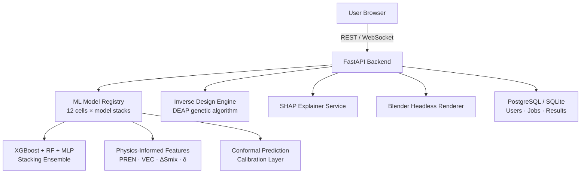
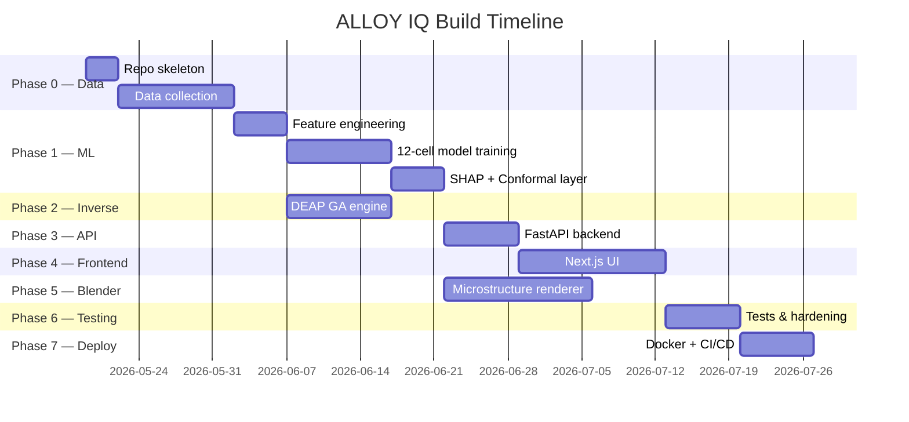

# ALLOY IQ — Implementation Plan

## What Is This?

A SaaS platform that predicts, interprets, and optimizes mechanical and corrosion properties of steels, high-entropy alloys (HEAs), and aluminum alloys from composition + processing parameters — with SHAP explainability, conformal-prediction uncertainty, an inverse design engine, and a Blender-driven 3D microstructure visualizer.

---

## Open Questions

> [!IMPORTANT]
> **Answer these before execution begins — they affect the entire stack.**

1. **Deployment target** — Are you self-hosting (a VPS / cloud VM) or targeting a managed PaaS (e.g., Railway, Render, AWS)? This affects model-serving strategy.
2. **Data sources** — Do you have a starting dataset, or should the plan include a data-collection/scraping step from public sources (MPEA database, Matminer, AFLOW, literature PDFs)?
3. **Blender visualizer delivery** — Should the microstructure render be done server-side (Blender headless on the backend) or client-side (Three.js procedural grain visualization in the browser)? Server-side Blender is richer but heavier.
4. **Auth / accounts** — Multi-tenant SaaS with paid tiers, or single-user tool for now?
5. **Frontend framework preference** — React (Next.js) or something simpler (Flask + Jinja2)?

---

## Architecture Overview



---

## Phase 0 — Foundation & Data (Week 1–2)

> [!NOTE]
> Everything downstream depends on clean, well-structured data. Do not skip or rush this phase.

### Repository & Project Skeleton

#### [NEW] `alloy-iq/` — root monorepo

```
alloy-iq/
├── backend/          # FastAPI + ML
├── frontend/         # React / Next.js
├── blender/          # Blender scripting visualizer
├── notebooks/        # EDA + model experiments
├── data/
│   ├── raw/
│   └── processed/
└── docker-compose.yml
```

### Data Collection & Curation

| Source | Coverage | Access |
|---|---|---|
| **Matminer** (citrination) | Steel YS, hardness, fatigue | Python API |
| **MPEA Database** | HEA YS, hardness | Web scrape / download |
| **AFLOW** | HEA phase + properties | REST API |
| **ASM Handbooks (digitized)** | Al alloys | Manual entry / OCR |
| **Literature (PDFs)** | Sparse cells | Manual extraction |

**Target minimum rows per cell:**

| Cell | Target Rows |
|---|---|
| Steel YS | 8,000+ |
| Steel Hardness | 8,000+ |
| Steel Fatigue | 2,000+ |
| Steel Corrosion (PREN) | 1,500+ |
| HEA YS | 1,200+ |
| HEA Hardness | 1,200+ |
| HEA Fatigue | 150–300 |
| HEA Corrosion | 150–300 |
| Al YS | 3,000+ |
| Al Hardness | 2,000+ |
| Al Fatigue | 1,000+ |
| Al Corrosion | 400+ |

#### [NEW] `backend/data/pipeline.py`
- Matminer query scripts
- Feature computation (Magpie via `matminer.featurizers`)
- Physics-informed feature engineering:
  - **Steels**: Carbon Equivalent (CE), PREN, HAZ proxy
  - **HEAs**: ΔS_mix, VEC, δ (atomic size mismatch), ΔH_mix (Miedema)
  - **Al alloys**: precipitation strengthening proxy, quench sensitivity index

---

## Phase 1 — ML Model Engine (Week 3–5)

### Strategy per cell (the "12-cell" matrix)

| Coverage | Strategy |
|---|---|
| **Rich** (Steel YS/Hardness, Al YS) | XGBoost + Random Forest + MLP → Stacking with Ridge meta-learner. Bayesian HPO via Optuna. Target R² > 0.93. |
| **Moderate** (HEA YS/Hardness, Steel Fatigue/Corrosion, Al Hardness/Fatigue) | Physics-informed features + ensemble. Optuna HPO. R² > 0.85. |
| **Sparse** (HEA Fatigue/Corrosion, Al Corrosion) | Transfer learning (fine-tune from steel/Al models) + conformal prediction intervals. Display "Low Data Confidence" badge. |

### SHAP Explainability Layer

#### [NEW] `backend/ml/shap_service.py`
- Compute TreeSHAP (XGBoost/RF) and KernelSHAP (MLP)
- Merge contributions per element and processing parameter
- Generate JSON: `{feature: str, shap_value: float, direction: "positive"|"negative"}`
- **Auto-generate plain-English narrative**: template engine maps top-3 SHAP contributors to sentences like: *"Molybdenum is the largest driver of corrosion resistance (+12 PREN units). Sulfur is your greatest risk factor (−3.2 PREN)."*

### Conformal Prediction Layer

#### [NEW] `backend/ml/conformal.py`
- Split-conformal calibration (holdout calibration set, 10% of data)
- Outputs calibrated interval at user-selectable confidence (80%, 90%, 95%)
- Coverage guarantee without distributional assumptions

### Model Registry

#### [NEW] `backend/ml/registry.py`
- Stores trained models as `.pkl` / `.joblib`
- Versioning: `model_id = f"{alloy_family}_{property}_{version}"`
- Hot-reload without server restart

---

## Phase 2 — Inverse Design Engine (Week 5–6)

#### [NEW] `backend/engines/inverse_design.py`

**Inputs:**
- Property targets (e.g., YS > 900 MPa, KIc > 80 MPa√m, PREN > 35)
- Element fraction constraints (e.g., Cr ∈ [15%, 25%], Ni ∈ [8%, 12%])
- Alloy family (Steel / HEA / Al)

**Algorithm:** NSGA-II (multi-objective) via **DEAP**
- Each individual = composition vector (element fractions summing to 1)
- Fitness = model predictions for each target property
- Constraints enforced via penalty on sum-deviation and bounds violation
- Returns **Pareto front** as list of candidate alloys

**Output:**
```json
{
  "pareto_front": [
    {"composition": {"Fe": 0.65, "Cr": 0.18, ...}, "YS": 910, "PREN": 36.2},
    ...
  ],
  "trade_off_axis": ["YS", "PREN"]
}
```

---

## Phase 3 — Backend API (Week 6–7)

#### [NEW] `backend/main.py` — FastAPI app

| Endpoint | Method | Description |
|---|---|---|
| `/predict` | POST | Forward prediction — returns property + SHAP + confidence interval |
| `/inverse` | POST | Inverse design — returns Pareto front |
| `/visualize` | POST | Trigger Blender render — returns image URL |
| `/history` | GET | User's past prediction jobs |
| `/auth/register` | POST | New user |
| `/auth/login` | POST | JWT token |

**Tech stack:**
- **FastAPI** + **Pydantic** for validation
- **SQLite** (dev) → **PostgreSQL** (prod)
- **Celery + Redis** for async Blender renders and long GA runs
- **JWT** auth

---

## Phase 4 — Frontend (Week 7–9)

> [!IMPORTANT]
> The UI must be demo-ready for a PhD materials scientist. Design = trust signal.

### Pages

| Page | Purpose |
|---|---|
| `/` Landing | Hero, feature highlights, CTA |
| `/predict` | Composition input → instant prediction |
| `/inverse` | Target spec → Pareto front explorer |
| `/microstructure` | Blender render viewer |
| `/history` | Past jobs dashboard |
| `/docs` | API docs (auto from FastAPI /docs) |

### Key UI Components

#### Composition Input Widget
- Periodic table-style element picker
- Real-time fraction sum validation (must equal 100%)
- Processing parameter sliders (heat treatment temp, cooling rate, etc.)

#### Prediction Results Card
- Property value + confidence bar
- SHAP waterfall chart (using **Plotly** or **D3.js**)
- Auto-generated narrative paragraph
- Data confidence badge (🟢 High / 🟡 Moderate / 🔴 Low)

#### Pareto Front Explorer
- 2D scatter: Objective A vs Objective B
- Click a point → show that candidate's full composition
- Export as CSV

#### Microstructure Viewer
- Embedded render from Blender
- Phase legend: Martensite, Ferrite, Carbide, Austenite
- Download button

**Tech:** Next.js 14 + TypeScript, Plotly.js for charts, Framer Motion for animations, Tailwind CSS

---

## Phase 5 — Blender Microstructure Visualizer (Week 9–11)

#### [NEW] `blender/microstructure_generator.py`

**Inputs** (from prediction API):
```python
{
  "martensite_pct": 72.0,
  "ferrite_pct": 20.0,
  "carbide_pct": 6.0,
  "austenite_pct": 2.0,
  "grain_size_um": 25.0
}
```

**Pipeline:**
1. **Grain generation** — Voronoi tessellation via `scipy.spatial.Voronoi` fed into Blender geometry
2. **Phase assignment** — Random seed-based assignment proportional to phase fractions
3. **Carbide precipitates** — Particle system placed at `carbide_pct` volume fraction
4. **Volume shaders** — Each phase gets a unique PBR material:
   - Martensite: dark grey metallic, high roughness
   - Ferrite: lighter grey, soft metallic
   - Carbide: near-black, high specular
   - Austenite: slight amber tint
5. **Render** — Cycles engine, 256 samples, 1920×1080, saved as PNG
6. **Delivery** — PNG served via `/visualize` endpoint

**Execution mode:** Blender headless (`blender --background --python microstructure_generator.py`)

---

## Phase 6 — Testing & Hardening (Week 11–12)

| Test Type | Scope |
|---|---|
| Unit tests | Feature engineering, SHAP output, conformal intervals |
| Integration tests | `/predict` end-to-end with mock models |
| Model validation | Cross-validation R², RMSE per cell vs. literature benchmarks |
| Conformal coverage | Empirical coverage = claimed confidence ± 1% on holdout |
| UI tests | Playwright — input composition → see chart |
| Load test | 50 concurrent prediction requests |

---

## Phase 7 — Deployment (Week 12–13)

#### [NEW] `docker-compose.yml`
- `api` service: FastAPI + Gunicorn
- `worker` service: Celery worker (runs Blender, DEAP)
- `redis` service: Task queue
- `db` service: PostgreSQL

**CI/CD:** GitHub Actions → build + test on every push → deploy to cloud on merge to `main`

**Pricing tiers (SaaS model):**
| Tier | Limit | Price |
|---|---|---|
| Free | 10 predictions/month | $0 |
| Pro | Unlimited predictions, 50 inverse runs/month | $49/mo |
| Enterprise | API access, custom models, SLA | Custom |

---

## Execution Order (Summary)



---

## Technology Stack Summary

| Layer | Technology |
|---|---|
| ML models | scikit-learn, XGBoost, PyTorch (MLP), SHAP, DEAP, Optuna |
| Feature engineering | Matminer, pymatgen, numpy, scipy |
| Backend API | FastAPI, Pydantic, SQLAlchemy, Celery, Redis |
| Database | SQLite (dev) → PostgreSQL (prod) |
| Frontend | Next.js 14, TypeScript, Plotly.js, Framer Motion, Tailwind CSS |
| Microstructure viz | Blender (headless Python scripting) |
| DevOps | Docker, Docker Compose, GitHub Actions |
| Auth | JWT (python-jose) |

---

## Immediate Next Steps (This Week)

- [ ] Confirm answers to the **Open Questions** above
- [ ] Create the monorepo skeleton
- [ ] Set up Matminer and pull Steel YS / Hardness datasets
- [ ] Compute Magpie + PREN features on the steel dataset
- [ ] Train a baseline XGBoost model on Steel YS (validates the pipeline end-to-end)
- [ ] Stand up a minimal FastAPI with `/predict` endpoint returning a mocked response
