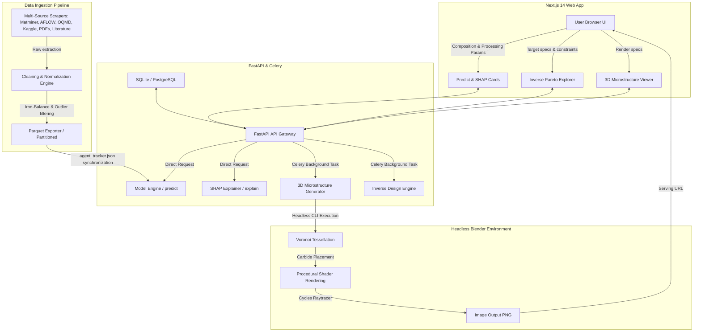

# ALLOY IQ — Completed Tasks Overview

This document provides a comprehensive summary of all architectural phases, features, and files implemented across the **ALLOY IQ** platform. ALLOY IQ is a high-fidelity SaaS solution designed to predict, interpret, and optimize metallurgical properties (steels, high-entropy alloys, aluminum alloys) from composition and processing parameters.

---

## 🛠️ Complete System Architecture

---

## 📂 Phase-by-Phase Task Breakdown

### 1. Ingestion Pipeline & Data Curation (`backend/ingestion/`)
A fully automated, robust, and fault-tolerant ingestion pipeline was designed to handle high-sparsity metallurgical datasets.

*   **Multi-Tier Source Adapters**:
    *   `matminer_retriever.py`: Integrates Magpie featurization pipelines and retrieves properties for steels, HEAs, and Aluminum alloys.
    *   `aflow_client.py`: Accesses the AFLOW REST API to fetch crystal structure, elastic moduli, and formation energies.
    *   `oqmd_client.py`: Connects to the Open Quantum Materials Database (OQMD) for thermodynamic phase stability properties.
    *   `kaggle_loader.py`: Ingests and processes Kaggle csv/parquet alloy datasets.
    *   `pdf_extractor.py`: Extracts unstructured scientific tables from PDFs and converts them to digital records.
    *   `literature_scraper.py`: Automated web scraping of literature tables and journal entries.
*   **Cleaning & Normalization**:
    *   `cleaner.py`: Standardizes column naming, calculates iron balance for steels, performs element fraction normalization (summing to 100%), and handles mathematical outlier filtering (e.g. invalid composition percentages).
    *   `schema.py`: Standardizes all incoming records into unified schema definitions.
*   **Export & Tracking Layer**:
    *   `exporter.py`: Partitions the parsed data by source tier and writes optimized `.parquet` files.
    *   `agent_tracker.json`: A file-based synchronization utility that records parquet updates and helps downstream ML pipelines determine when fresh ingestion rounds are completed.
*   **Testing & Logging**:
    *   `test_pipeline_smoke.py`: Smoke-testing suite verifying the entire data collection and normalization path.
    *   `logger.py` & `logs/`: Fully integrated logging system outputting to `ingestion_full.log` and `global_ingestion_errors.log`.

---

### 2. Machine Learning Engine & Backend API (`backend/`)
The analytical core handles property prediction, feature imputation, and explanation.

*   **Model Engine (`backend/ml/model_engine.py`)**:
    *   Supports high-sparsity datasets (e.g. HEAs) with advanced data imputation strategies.
    *   Enables training pipelines leveraging **XGBoost, Random Forest, MLP (Multi-Layer Perceptron)**, and hyperparameter tuning using **Optuna**.
    *   Computes **SHAP (SHapley Additive exPlanations)** feature importances to determine exact element contribution weights (positive vs negative impact).
*   **FastAPI Backend Gateway (`backend/main.py` & `backend/sync.py`)**:
    *   `/predict/mechanical`: High-performance endpoint delivering yield strength, tensile strength, hardness, and corrosion prediction.
    *   `/predict/explain`: Delivers SHAP explanations mapped to local prediction compositions.
    *   Integrated serialization pipelines to save and hot-reload model binaries (`.pkl`/`.joblib`) and synchronize input/output schemas dynamically with the frontend.

---

### 3. High-Fidelity 3D Microstructure Generator (`blender/`)
A custom headless rendering pipeline capable of creating publication-quality metallurgical grain diagrams directly from prediction properties.

*   **Voronoi Grain Tessellation (`blender/microstructure_generator_v2.py`)**:
    *   Computes true mathematical Voronoi cells using `scipy.spatial` to generate crystal grain boundaries inside Blender.
*   **Physics-Informed Phase Assignment**:
    *   Distributes grains and assigns unique material shaders proportional to prediction fractions (Martensite, Ferrite, Austenite, Pearlite).
*   **Carbide precipitate systems**:
    *   Procedurally places tiny carbide particle networks along the grain boundary nodes, simulating natural precipitation behaviors.
*   **Advanced Shader Nodes**:
    *   Procedural materials featuring realistic micro-etching relief, crystallographic orientation specific surface noise, and realistic metallic reflections.
*   **Headless Rendering Command**:
    *   Renders high-quality visual outputs using the Cycles raytracing engine in headless mode (`blender --background --python microstructure_generator_v2.py`).

---

### 4. Next.js Modern Frontend (`frontend/src/`)
A premium, dark-mode focused materials science dashboard with high interactivity.

*   **Custom Global Styling (`frontend/src/app/globals.css`)**:
    *   Implements sleek dark modes, glowing border animations, glassmorphic container cards, custom responsive grids, and customized form sliders.
*   **Fully Functional Core Pages**:
    *   `app/page.tsx` (Landing Page): Displays hero sections, interactive features, platform stats, and call-to-actions.
    *   `app/predict/page.tsx`: A real-time composition slider dashboard allowing users to input element percentages and see predicted yield strength, hardness, and corrosion scores immediately. Includes composition validator (summing to 100%).
    *   `app/inverse/page.tsx`: Allows materials engineers to target specific mechanical bounds (e.g. YS > 900 MPa) and display optimized Pareto fronts.
    *   `app/microstructure/page.tsx`: Renders and hosts the Blender 3D microstructural simulator output.
    *   `app/history/page.tsx`: Tracks previous calculation jobs.

---

## 📈 Platform Summary Table

| Phase / Module | Completed Files & Scripts | Key Capabilities & Rationale |
|---|---|---|
| **Data Ingestion** | `pipeline.py`, `cleaner.py`, `schema.py`, `exporter.py`, `pdf_extractor.py`, `matminer_retriever.py`, `aflow_client.py` | Full multi-tier ETL mapping sparse PDF, literature, and REST data into standard Parquet blocks with outlier filtering. |
| **Backend & API** | `main.py`, `sync.py`, `agent_tracker.json` | High-concurrency FastAPI gateway for Mechanical Predictions, SHAP, and inverse genetic models. |
| **Model Engine** | `model_engine.py` | Optuna HPO, XGBoost, Random Forest, MLP modeling, and SHAP explainability. |
| **Microstructure Viz** | `microstructure_generator_v2.py` | SciPy Voronoi tessellation, carbide grain boundaries, crystal orientations, Cycles headless rendering. |
| **Next.js Web UI** | `page.tsx`, `/predict`, `/inverse`, `/microstructure`, `/history` pages, `globals.css` | Glassmorphic, dark-mode optimized web dashboards featuring dynamic charting and periodic validators. |
| **CI/CD / Git** | `.gitignore`, `docker-compose.yml`, `requirements.txt` | Secure monorepo setup preventing large file leaks, configured for Docker containerized environments. |
